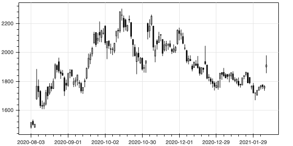
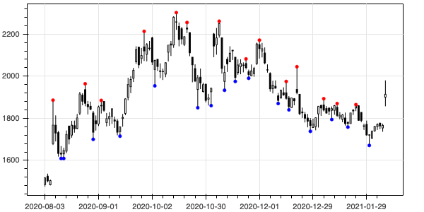
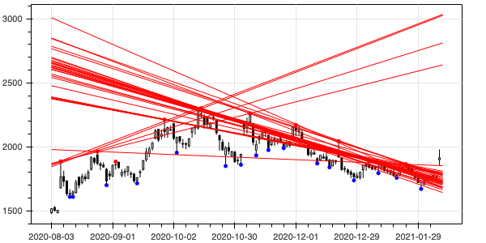
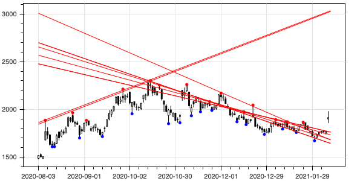
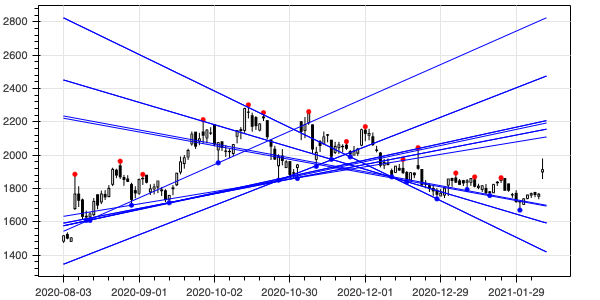
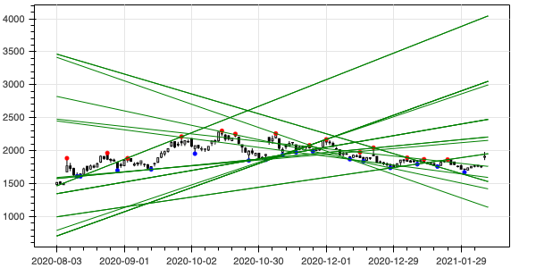
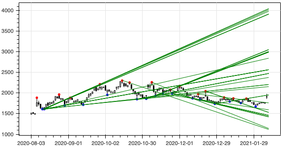
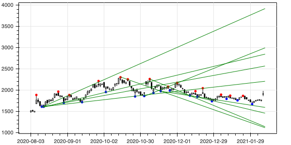
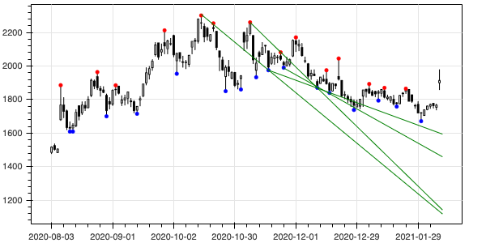
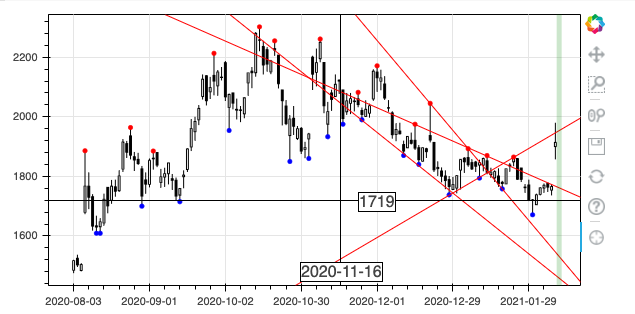

[](https://colab.research.google.com/github/Soliton-Analytics-Team/Trendline/blob/main/TrendLine.ipynb)

# ローソク足に自動的にトレンドラインを引く

[以前の記事](https://www.soliton-cyber.com/blog/colab-bokeh-candlestick)でローソク足を作成しました。今回は、それにトレンドラインを自動的に引いてみたいと思います。

まずは弊社の株価を取得します。


```Python
import pandas_datareader.data as web
df = web.DataReader("3040.JP", "stooq").dropna().sort_index()
```

次にローソク足を作成する関数を定義して実行します。この詳細は[以前の記事](https://www.soliton-cyber.com/blog/colab-bokeh-candlestick)を参照してください。


```Python
from bokeh.plotting import figure, show, output_notebook
from bokeh.models import ColumnDataSource
import pandas as pd

def candlestick(df, plot_width=600, plot_height=300):
    df = df.reset_index()
    source = ColumnDataSource(df)
    inc = ColumnDataSource(df[df.Close >= df.Open])
    dec = ColumnDataSource(df[df.Open > df.Close])
    w = (df.index[1] - df.index[0]) / 2  # X軸の1メモリの半分

    fig = figure(plot_width=plot_width, plot_height=plot_height)
    fig.segment('index', 'High', 'index', 'Low', source=source, color="black")
    fig.vbar('index', w, 'Open', 'Close', source=inc, line_color="black", fill_color="white")
    fig.vbar('index', w, 'Open', 'Close', source=dec, line_color="black", fill_color="black")
    fig.xaxis.major_label_overrides = {
        i: pd.to_datetime(date).strftime('%Y-%m-%d') for i, date in enumerate(source.data['Date'])
    }
    fig.xaxis.bounds = (0, df.index[-1]) # X軸の範囲を明示的に指定
    fig.outline_line_color = 'black'
    return fig

fig = candlestick(df['2020-8-1':])
output_notebook()
show(fig)
```



このローソク足にトレンドラインをひくために、まずはピークの点を取得する必要があります。ピークの点とは、前後のある程度の範囲において最も価格が高いあるいは低い点です。

前後の7点（前に3点、後ろに3点)の範囲を取得するにはpandasのrolling(7, center=True)を使います。


```Python
df.rolling(7, center=True)
```


    Rolling [window=7,center=True,axis=0]


これはそれぞれ7個の要素を持った配列の配列とみなせます。その様子を見てみましょう


```Python
list(df[:10].rolling(7, center=True))
```


    [              Open    High     Low   Close  Volume
     Date                                              
     2016-02-08  563.09  589.41  558.71  588.92   14973,
                   Open    High     Low   Close  Volume
     Date                                              
     2016-02-08  563.09  589.41  558.71  588.92   14973
     2016-02-09  556.75  561.63  546.52  548.47   15178,
                   Open    High     Low   Close  Volume
     Date                                              
     2016-02-08  563.09  589.41  558.71  588.92   14973
     2016-02-09  556.75  561.63  546.52  548.47   15178
     2016-02-10  536.27  536.27  511.90  523.12    6974,
                   Open    High     Low   Close  Volume
     Date                                              
     2016-02-08  563.09  589.41  558.71  588.92   14973
     2016-02-09  556.75  561.63  546.52  548.47   15178
     2016-02-10  536.27  536.27  511.90  523.12    6974
     2016-02-12  479.23  514.82  477.78  510.43   23588,
                   Open    High     Low   Close  Volume
     Date                                              
     2016-02-08  563.09  589.41  558.71  588.92   14973
     2016-02-09  556.75  561.63  546.52  548.47   15178
     2016-02-10  536.27  536.27  511.90  523.12    6974
     2016-02-12  479.23  514.82  477.78  510.43   23588
     2016-02-15  510.43  530.92  487.52  495.82    7179,
                   Open    High     Low   Close  Volume
     Date                                              
     2016-02-08  563.09  589.41  558.71  588.92   14973
     2016-02-09  556.75  561.63  546.52  548.47   15178
     2016-02-10  536.27  536.27  511.90  523.12    6974
     2016-02-12  479.23  514.82  477.78  510.43   23588
     2016-02-15  510.43  530.92  487.52  495.82    7179
     2016-02-16  530.92  565.52  516.28  541.15   32203,
                   Open    High     Low   Close  Volume
     Date                                              
     2016-02-08  563.09  589.41  558.71  588.92   14973
     2016-02-09  556.75  561.63  546.52  548.47   15178
     2016-02-10  536.27  536.27  511.90  523.12    6974
     2016-02-12  479.23  514.82  477.78  510.43   23588
     2016-02-15  510.43  530.92  487.52  495.82    7179
     2016-02-16  530.92  565.52  516.28  541.15   32203
     2016-02-17  536.27  541.15  487.52  490.45   45946,
                   Open    High     Low   Close  Volume
     Date                                              
     2016-02-09  556.75  561.63  546.52  548.47   15178
     2016-02-10  536.27  536.27  511.90  523.12    6974
     2016-02-12  479.23  514.82  477.78  510.43   23588
     2016-02-15  510.43  530.92  487.52  495.82    7179
     2016-02-16  530.92  565.52  516.28  541.15   32203
     2016-02-17  536.27  541.15  487.52  490.45   45946
     2016-02-18  502.16  515.81  492.39  493.38   26870,
                   Open    High     Low   Close  Volume
     Date                                              
     2016-02-10  536.27  536.27  511.90  523.12    6974
     2016-02-12  479.23  514.82  477.78  510.43   23588
     2016-02-15  510.43  530.92  487.52  495.82    7179
     2016-02-16  530.92  565.52  516.28  541.15   32203
     2016-02-17  536.27  541.15  487.52  490.45   45946
     2016-02-18  502.16  515.81  492.39  493.38   26870
     2016-02-19  493.38  495.32  488.98  488.98    8615,
                   Open    High     Low   Close  Volume
     Date                                              
     2016-02-12  479.23  514.82  477.78  510.43   23588
     2016-02-15  510.43  530.92  487.52  495.82    7179
     2016-02-16  530.92  565.52  516.28  541.15   32203
     2016-02-17  536.27  541.15  487.52  490.45   45946
     2016-02-18  502.16  515.81  492.39  493.38   26870
     2016-02-19  493.38  495.32  488.98  488.98    8615
     2016-02-22  488.98  502.16  488.98  497.27    4307]


ここから高値だけを取り出すには以下のようにします。


```Python
list(df[:10].rolling(7, center=True).High)
```


    [Date
     2016-02-08    589.41
     Name: High, dtype: float64, Date
     2016-02-08    589.41
     2016-02-09    561.63
     Name: High, dtype: float64, Date
     2016-02-08    589.41
     2016-02-09    561.63
     2016-02-10    536.27
     Name: High, dtype: float64, Date
     2016-02-08    589.41
     2016-02-09    561.63
     2016-02-10    536.27
     2016-02-12    514.82
     Name: High, dtype: float64, Date
     2016-02-08    589.41
     2016-02-09    561.63
     2016-02-10    536.27
     2016-02-12    514.82
     2016-02-15    530.92
     Name: High, dtype: float64, Date
     2016-02-08    589.41
     2016-02-09    561.63
     2016-02-10    536.27
     2016-02-12    514.82
     2016-02-15    530.92
     2016-02-16    565.52
     Name: High, dtype: float64, Date
     2016-02-08    589.41
     2016-02-09    561.63
     2016-02-10    536.27
     2016-02-12    514.82
     2016-02-15    530.92
     2016-02-16    565.52
     2016-02-17    541.15
     Name: High, dtype: float64, Date
     2016-02-09    561.63
     2016-02-10    536.27
     2016-02-12    514.82
     2016-02-15    530.92
     2016-02-16    565.52
     2016-02-17    541.15
     2016-02-18    515.81
     Name: High, dtype: float64, Date
     2016-02-10    536.27
     2016-02-12    514.82
     2016-02-15    530.92
     2016-02-16    565.52
     2016-02-17    541.15
     2016-02-18    515.81
     2016-02-19    495.32
     Name: High, dtype: float64, Date
     2016-02-12    514.82
     2016-02-15    530.92
     2016-02-16    565.52
     2016-02-17    541.15
     2016-02-18    515.81
     2016-02-19    495.32
     2016-02-22    502.16
     Name: High, dtype: float64]


そして、それぞれの中の最高値を取り出すのは以下。


```Python
df[:20].rolling(7, center=True).High.max()
```


    Date
    2016-02-08       NaN
    2016-02-09       NaN
    2016-02-10       NaN
    2016-02-12    589.41
    2016-02-15    565.52
    2016-02-16    565.52
    2016-02-17    565.52
    2016-02-18    565.52
    2016-02-19    565.52
    2016-02-22    541.15
    2016-02-23    515.81
    2016-02-24    553.34
    2016-02-25    553.34
    2016-02-26    556.26
    2016-02-29    567.95
    2016-03-01    567.95
    2016-03-02    567.95
    2016-03-03       NaN
    2016-03-04       NaN
    2016-03-07       NaN
    Name: High, dtype: float64


上記がそれぞれの前後の範囲での最高値なので、それがその日の高値と一致する場合、その日は前後の範囲での高値のピークであることが分かります。以下で実際に算出してみましょう。Trueとなっている日が高値のピークの日です。


```Python
df[:20].rolling(7, center=True).High.max() == df[:20].High
```


    Date
    2016-02-08    False
    2016-02-09    False
    2016-02-10    False
    2016-02-12    False
    2016-02-15    False
    2016-02-16     True
    2016-02-17    False
    2016-02-18    False
    2016-02-19    False
    2016-02-22    False
    2016-02-23    False
    2016-02-24    False
    2016-02-25    False
    2016-02-26    False
    2016-02-29    False
    2016-03-01    False
    2016-03-02    False
    2016-03-03    False
    2016-03-04    False
    2016-03-07    False
    Name: High, dtype: bool


これを利用して高値と安値のピークを赤丸と青丸で表示するローソク足を生成する関数を作成します。


```Python
def show_peaks(target):
    fig = candlestick(target)
    target = target.reset_index()
    upPeak = target[target.rolling(7, center=True).High.max() == target.High]  # (1)
    fig.circle(upPeak.index, upPeak.High, color='red')
    dnPeak = target[target.rolling(7, center=True).Low.min() == target.Low] # (2)
    fig.circle(dnPeak.index, dnPeak.Low, color='blue')
    return fig, upPeak, dnPeak

fig, _, _ = show_peaks(df['2020-8-1':])
output_notebook()
show(fig)
```





上記では、pandasのファンシーインデックスを利用しています。これは、array[[True, False, True, False]]のようにインデックスに論理値の配列を渡すことでTrueに対応した位置の値で構成された配列を返す機能です。この場合では1番目の3番目の値で構成された配列が返ることになります。従って、上記の(1)や(2)のようにすることでピークの要素だけで構成された配列を取得できます。後で使用するので、関数ではそれらのピーク値も戻り値として返しています。


ピーク値を結ぶことでトレンドラインを引くことができます。そこでまず高値のピーク値を結ぶ直線を描きます。


```Python
from itertools import combinations
from scipy.stats import linregress

target = df['2020-8-1':]
fig, upPeak, _ = show_peaks(target) # (3)
lgs = []
for select in combinations(upPeak.index, 3):  # (4)
    peaks = [upPeak.High[i] for i in upPeak.index if i in select]  # (5)
    lgs.append(linregress(select, peaks))  # (6)

for lg in [lg for lg in lgs if lg.pvalue < 0.05]: # (7)
    fig.line([0, len(target)], [lg.intercept, lg.intercept + len(target) * lg.slope], color='red')
output_notebook()
show(fig)
```




(3) upPeakに高値のピークを取得しています。

(4) combinations()は組合せを生成します。ここではupPeakのインデックスから3点を選ぶ組合せを生成してselectに格納し、繰り返します。

(5) 選ばれたインデックス（X座標)に対応する値(Y座標)をpeaksに格納します。

(6) linregress()は引数に渡された点を結ぶ直線を生成します。第一引数がX座標の配列、第二引数がY座標の配列です。

(7) pvalueは直線の信頼度を表す値です。値が小さいほど各点が直線上に乗っている度合いが大きいと言えます。ここでは0.05未満の直線のみを描画しています。

上記では全ての高値のピーク値を対象に3点の組合せを選んでいるので、非常に遠く離れた点も含まれてしまいます。範囲が広がりすぎると無意味なトレンドラインの可能性が高くなるので、範囲を絞りましょう。


```Python
from itertools import combinations
from scipy.stats import linregress

target = df['2020-8-1':]
fig, upPeak, _ = show_peaks(target)
lgs = []
for r in upPeak.rolling(5): # (8)
    for select in combinations(r.index, 3):
        peaks = [upPeak.High[i] for i in upPeak.index if i in select]
        lgs.append(linregress(select, peaks))
for lg in [lg for lg in lgs if lg.pvalue < 0.05]:
    fig.line([0, len(target)], [lg.intercept, lg.intercept + len(target) * lg.slope], color='red')
output_notebook()
show(fig)
```





(8) rolling(5)によってupPeakの中で連続する5点ずつがグループ化されます。各グループがrに代入され、繰り返します。

高値のピークの連続した５点のなかで直線を構成するものによるトレンドラインが引けています。


同様に安値のトレンドラインを生成しましょう。


```Python
from itertools import combinations
from scipy.stats import linregress

target = df['2020-8-1':]
fig, _, dnPeak = show_peaks(target)
lgs = []
for r in dnPeak.rolling(5):
    for select in combinations(r.index, 3):
        peaks = [dnPeak.Low[i] for i in dnPeak.index if i in select]
        lgs.append(linregress(select, peaks))
for lg in [lg for lg in lgs if lg.stderr < 0.5]:
    fig.line([0, len(target)], [lg.intercept, lg.intercept + len(target) * lg.slope], color='blue')
output_notebook()
show(fig)
```




高値と安値のピークを同時に使ったトレンドラインは以下のように生成します。


```Python
from itertools import combinations
from scipy.stats import linregress
from pandas import concat

target = df['2020-8-1':]
fig, upPeak, dnPeak = show_peaks(target)
lgs = []
peaks = concat([upPeak.rename(columns={'High': 'price'}).price, dnPeak.rename(columns={'Low': 'price'}).price]).sort_index() # (9)
for r in peaks.rolling(7):
    for select in combinations(r.index, 3):
        prices = [peaks[i] for i in select]
        lgs.append(linregress(select, prices))
for lg in [lg for lg in lgs if lg.stderr < 0.5]:
    fig.line([0, len(target)], [lg.intercept, lg.intercept + len(target) * lg.slope], color='green')
output_notebook()
show(fig)
```





(9) concat()を使って、upPeakとdnPeakを連結し、インデックス順にソートしています。

トレンドラインが発生する前の時点では描画しないようにするには、以下のようにして始点を設定します。


```Python
from itertools import combinations
from scipy.stats import linregress
from pandas import concat

target = df['2020-8-1':]
fig, upPeak, dnPeak = show_peaks(target)
peaks = concat([upPeak.rename(columns={'High': 'price'}).price, dnPeak.rename(columns={'Low': 'price'}).price]).sort_index()
lgs = []
for r in peaks.rolling(7):
    for select in combinations(r.index, 3):
        prices = [peaks[i] for i in select]
        lgs.append((select, linregress(select, prices)))
for lg in [lg for lg in lgs if lg[1].pvalue < 0.05]:
    select, lin = lg
    fig.line([select[0], len(target)], [lin.intercept + select[0] * lin.slope, lin.intercept + len(target) * lin.slope], color='green')
output_notebook()
show(fig)
```




ほぼ同じトレンドラインがいくつも重なっているのが気になります。それらの内、一つだけを表示する処理を追加しましょう。


```Python
from itertools import combinations
from scipy.stats import linregress
from pandas import concat
from math import atan, degrees

def trendlines(peaks, last_index, rolling=7) -> []:
    std = peaks.std()
    items = []
    for r in peaks.rolling(rolling):
        for select in combinations(r.index, 3):
            prices = [peaks[i] for i in select]
            items.append((sorted(select), linregress(select, prices)))

    lines = []
    for item in items:
        lin = item[1]
        if lin.pvalue < 0.05:
            lines.append(item)

    if len(lines) > 0:
        thAngle = 0.5
        thDistance = 5
        newLines = [lines[0]]
        for line1 in lines[1:]:
            for line2 in newLines:
                if (abs(degrees(atan(line1[1].slope / std)) - degrees(atan(line2[1].slope / std))) <= thAngle
                    and abs(line1[1].intercept + line1[1].slope * last_index - line2[1].intercept - line2[1].slope * last_index) <= thDistance * std
                    ): # (10)
                    break
            else:
                newLines.append(line1)
        lines = newLines
    return lines

target = df['2020-8-1':]
fig, upPeak, dnPeak = show_peaks(target)
peaks = concat([upPeak.rename(columns={'High': 'price'}).price, dnPeak.rename(columns={'Low': 'price'}).price]).sort_index()
lines = trendlines(peaks, len(target))
for line in lines:
    pos, lin = line
    fig.line([pos[0], len(target)], [lin.intercept + pos[0] * lin.slope, lin.intercept + len(target) * lin.slope], color='green')

output_notebook()  # 出力先をノートブックに設定
show(fig)
```




(10) 二つの直線の角度が0.5度以下で、右端におけるy座標の差分が5以下の場合、同一直線とみなします。

それらしいトレンドラインが引けるようになりました。ただ、実際に投機の判断をする場合、現在の値、つまり一番右端の値と大きく離れたラインは参考になりません。そこで、現在の値に近いトレンドラインを４本だけ引いてみます。


```Python
target = df['2020-8-1':]
fig, upPeak, dnPeak = show_peaks(target)
peaks = concat([upPeak.rename(columns={'High': 'price'}).price, dnPeak.rename(columns={'Low': 'price'}).price]).sort_index()
lines = trendlines(peaks, len(target))
pos = len(target) - 1
price = (df.High.iloc[pos] + df.Low.iloc[pos]) / 2
lines = [line for line in sorted(lines, key=lambda x:abs(x[1].intercept + x[1].slope * pos - price))][:4] # (11)
for line in lines:
    pos, lin = line
    fig.line([pos[0], len(target)], [lin.intercept + pos[0] * lin.slope, lin.intercept + len(target) * lin.slope], color='green')

output_notebook()  # 出力先をノートブックに設定
show(fig)
```





(11) posの位置の価格とトレンドライン上の価格の差の絶対値でソートして、小さい順に4個を取得します。

これで一応完成です。ただ、現時点だけでなく、過去の時点でのトレンドラインから有益な知見が得られるかもしれません。そこで、現時点を動かせるようにしてみましょう。

以下では引数で指定した位置より前の情報でトレンドラインを生成するtrendlines()を定義しています。その後、右半分の各時点でのトレンドラインを取得して蓄積します。さらに図中に現時点を表す緑の縦棒を表示しています。そしてBokehのカスタム機能を使って、その縦線をドラッグできるようにし、その変化に伴って対応するトレンドラインだけを表示するようにしました。


```Python
%time

from bokeh.plotting import figure, show, output_notebook, output_file
from bokeh.models import Slope, Span, CustomJS
from bokeh import events
from itertools import combinations
from scipy.stats import linregress
from math import atan, degrees

def trendlines(peaks, pos, offset, rolling=7) -> []:
    std = peaks.std()
    lines = []
    for r in peaks[(pos - offset < peaks.index) * (peaks.index <= pos)].rolling(rolling):
        for select in combinations(r.index, 3):
            prices = [peaks[i] for i in select]
            lin = linregress(select, prices)
            if lin.pvalue < 0.05:
                lines.append(lin)
    
    if len(lines) > 0:
        thAngle = 0.5
        thDistance = 5
        newLines = [lines[0]]
        for line1 in lines[1:]:
            for line2 in newLines:
                if (abs(degrees(atan(line1.slope / std)) - degrees(atan(line2.slope / std))) <= thAngle
                    and abs(line1.intercept + line1.slope * pos - line2.intercept - line2.slope * pos) <= thDistance * std
                    ):
                    break
            else:
                newLines.append(line1)
        lines = newLines
    return lines

target = df['2020-8-1':]
fig, upPeak, dnPeak = show_peaks(target)
peaks = concat([upPeak.rename(columns={'High': 'price'}).price, dnPeak.rename(columns={'Low': 'price'}).price]).sort_index()

offset = 50
rolling = 7
lines = [None] * offset
prev = None
for pos in range(offset, len(target)):
    if prev is None or pos - rolling//2 - 1in peaks.index:
        prev = trendlines(peaks, pos, offset, rolling=rolling)
    price = (target.High.iloc[pos] + target.Low.iloc[pos]) / 2
    lines.append([line for line in sorted(prev, key=lambda x:abs(x.intercept + x.slope * pos - price))][:4])
lines.append([line for line in sorted(prev, key=lambda x:abs(x.intercept + x.slope * len(target) - price))][:4])

slopes = []
for line in lines[-1]:
    slope = Slope(gradient=line.slope, y_intercept=line.intercept, line_color='red')
    fig.add_layout(slope)
    slopes.append(slope)

span = Span(location=len(target), dimension='height', line_color='green', line_width=5, line_alpha=0.2)
fig.add_layout(span)

def pan_event(span, lines, slopes):
    return CustomJS(args=dict(span=span, lines=lines, slopes=slopes), code="""
        var loc = Math.round(parseFloat(cb_obj['x']))
        if (span.location != loc) {
            span.location = loc
            if (loc < lines.length && lines[loc]) {
                for (var i = 0; i < Math.min(lines[loc].length, slopes.length); ++i) {
                    slopes[i].visible = true
                    slopes[i].gradient = lines[loc][i][0]
                    slopes[i].y_intercept = lines[loc][i][1]
                }
                for (var i = lines[loc].length; i < slopes.length; ++i) {
                    slopes[i].visible = false
                }
            }
            else {
                for (var i = 0; i < slopes.length; ++i) {
                    slopes[i].visible = false
                }                    
            }
        }
    """)


fig.js_on_event(events.Tap, pan_event(span=span, lines=lines, slopes=slopes))
fig.js_on_event(events.Press, pan_event(span=span, lines=lines, slopes=slopes))
fig.js_on_event(events.Pan, pan_event(span=span, lines=lines, slopes=slopes))
fig.toolbar.active_drag = None

output_notebook()
show(fig)
```

    CPU times: user 3 µs, sys: 0 ns, total: 3 µs
    Wall time: 4.77 µs


さらに十字線とその値を表示する機能を追加しておきましょう。詳細は[以前の記事](https://www.soliton-cyber.com/blog/colab-bokeh-crosshairlabel)をご参照ください。


```Python
from bokeh.models import ColumnDataSource, CrosshairTool, Label

xlabel = Label(x_units='data',
               y_units='screen',
               render_mode='css',
               border_line_width=1, border_line_color='black', border_line_alpha=1.0,
               background_fill_color='white', background_fill_alpha=1.0,
               visible=False)

ylabel = Label(x_units='screen',
               y_units='data',
               render_mode='css',
               border_line_width=1, border_line_color='black', border_line_alpha=1.0,
               background_fill_color='white', background_fill_alpha=1.0,
               visible=False)

fig.add_layout(xlabel)
fig.add_layout(ylabel)

# https://docs.bokeh.org/en/latest/docs/user_guide/interaction/callbacks.html

def display_event(source, xlabel, ylabel):
    return CustomJS(args=dict(source=source, xlabel=xlabel, ylabel=ylabel), code="""
        try {
            xlabel.visible = true
            xlabel.x = cb_obj['x']
            xlabel.y = 25             // 日付を下辺に表示
            xlabel.x_offset = -40
            xlabel.y_offset = -20
            var date = new Date(source.data['Date'][Number(cb_obj['x']).toFixed(0)])
            xlabel.text = date.toISOString().substr(0, 10)
        } catch (e) {}
        ylabel.visible = true
        ylabel.y = cb_obj['y']
        ylabel.x = cb_obj['sx'] - 20  // 価格を十字の右に表示
        ylabel.y_offset = -10
        ylabel.text = Number(cb_obj['y']).toFixed(0)
    """)

def leave_event(xlabel, ylabel):
    return CustomJS(args=dict(xlabel=xlabel, ylabel=ylabel), code="""
        xlabel.visible = false
        ylabel.visible = false
    """)

source = ColumnDataSource(target)

fig.js_on_event(events.MouseMove, display_event(source=source, xlabel=xlabel, ylabel=ylabel))
fig.js_on_event(events.MouseLeave, leave_event(xlabel=xlabel, ylabel=ylabel))

fig.add_tools(CrosshairTool())
fig.toolbar.active_drag = None

output_notebook() # 出力先をノートブックに設定
output_file('trendline.html') # 出力先にファイルも指定
show(fig)
```




完成です。
